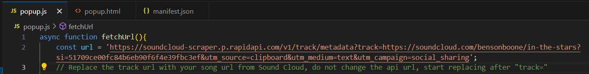
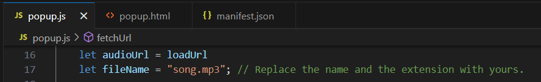

# SoundLoad - SoundCloud Songs Downloader
Google Chrome extension that allows to download the songs from SoundCloud _(Without a paid account)_

- Simply run _popup.html_

### OR

- Add Extension to Chrome:

**Manage Extensions** > Turn on **Developer mode** > Click **Load unpacked** > Select the folder where this **SounLoad** files are saved

### Song url from Sound Cloud
> In line 2 of __popup.js__ file, replace the track url with the song url from Sound Cloud that needs to be downloaded  

### Save song as
> In line 17 of __popup.js__ file, replace the file name with your preferred name for saving the song otherwise it will be saved as _song.mp3_  

  
